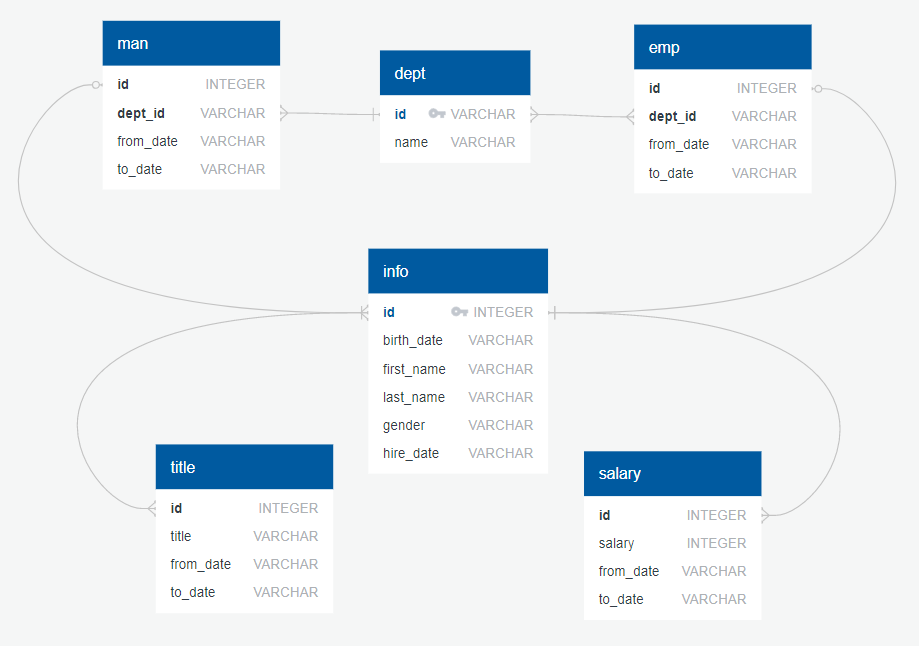

# <p align="center"> Model, Engineer, and Analyze Software Co. Database with PostgreSQL</p>


## Data Modeling


## Data Engineering

I created the following schemas:

```sql
CREATE TABLE department (
    id VARCHAR(255) PRIMARY KEY NOT NULL,
    name VARCHAR(255)
);

CREATE TABLE employee (
    emp_id INT,
    emp_dept VARCHAR(225),
    from_date DATE,
    to_date DATE,
    FOREIGN KEY (emp_dept) REFERENCES department(id)
);

CREATE TABLE manager (
    man_dept VARCHAR(225),
    man_id INT,
    from_date DATE,
    to_date DATE,
    FOREIGN KEY (man_dept) REFERENCES department(id),
    FOREIGN KEY (man_id) REFERENCES personal_info(id)
);

CREATE TABLE personal_info (
    id INT PRIMARY KEY NOT NULL,
    dob VARCHAR(225),
    first_name VARCHAR(225),
    last_name VARCHAR(225),
    gender VARCHAR(225),
    hire_date DATE
);

CREATE TABLE salary (
    salary_id INT,
    salary INT,
    from_date DATE,
    to_date DATE,
    FOREIGN KEY (salary_id) REFERENCES personal_info(id)
);

CREATE TABLE title (
    title_id INT,
    title VARCHAR(225),
    from_date DATE,
    to_date DATE,
    FOREIGN KEY (title_id) REFERENCES personal_info(id)
);

SELECT * FROM department;
SELECT * FROM employee;
SELECT * FROM manager;
SELECT * FROM personal_info;
SELECT * FROM salary;
SELECT * FROM title;

```

## Data Analysis

I performed the following analysis with queries of:

1. all employee numbers, last names, first names, genders, and salaries.

2. all employees who were hired in 1986.

3. all managers and their department numbers, department names, employee numbers, last names, first names, and start and end employment dates.

4. all departments of each employee with employee numbers, last names, first names, and department names.

5. all employees whose first name is "Hercules" and last names begin with "B."

6. all employees in the Sales department, including their employee numbers, last names, first names, and department names.

7. all employees in the Sales and Development departments with employee numbers, last names, first names, and department names.

8. the frequency count of employee last names in descending order.

